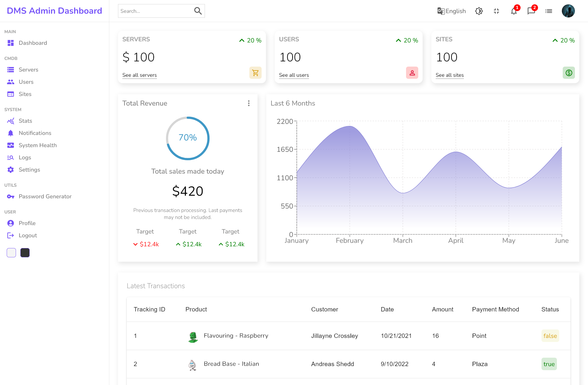
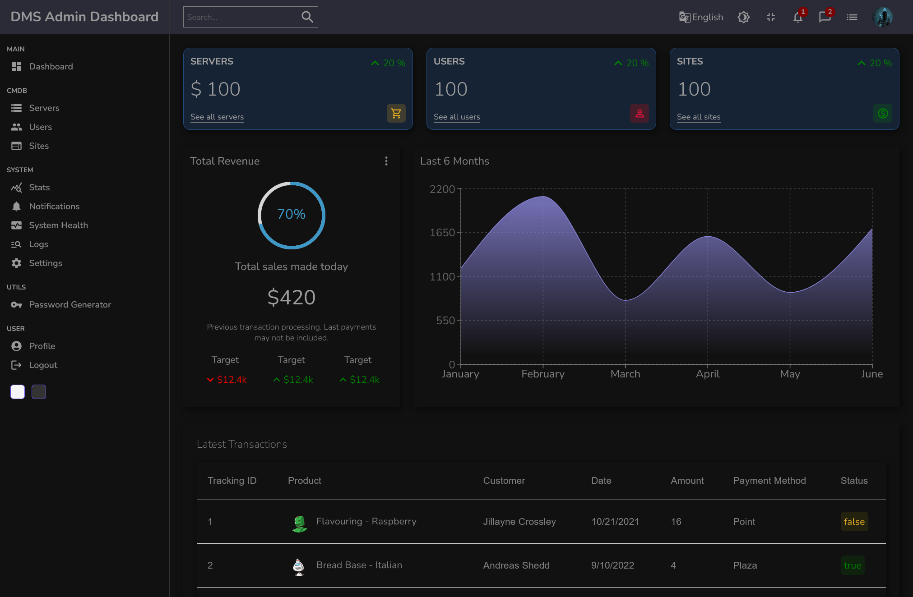

# dashboard-stormtrooper
React Admin Dashboard

# Live Demo
## https://danshin.ms/dashboard-stormtrooper/

## How to run project

1. Open project in VSCode (for example )
2. Run command `npm i` in terminal (console) for installing all required packages
3. For run project you can use the following commands:
   - `npm start` - start app in development mode

Then open http://localhost:3000/ to see your app.

When you’re ready to deploy to production, create a minified bundle with `npm run build`.

### Other projects:
https://hub.docker.com/r/mdanshin/dms-tasks

https://danshin.ms/dashboard-stormtrooper/

https://danshin.ms/dms-cmdb-template/

https://danshin.ms/dms-theme-demo/

https://github.com/mdanshin/flexbox-example

https://danshin.ms/dms-login-page-autumn/
